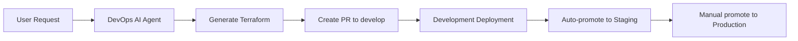

# 🚀 GitOps Development-First Strategy

## 🎯 Overview
This document outlines how the DevOps AI Agent always deploys to **Development** first, followed by promotion through **Staging** → **Production**.

## 📋 Branch Strategy

| Branch | Environment | Purpose | Auto-Deploy |
|--------|-------------|---------|-------------|
| `feature/*` | Development | DevOps AI Agent creates PRs here | ✅ Yes |
| `develop` | Development | Merges trigger dev deployment | ✅ Yes |
| `staging` | Staging | Promoted from develop after testing | ⚠️ Manual approval |
| `main` | Production | Promoted from staging after validation | ⚠️ Manual approval |

## 🔄 Workflow Architecture

### 1. **DevOps AI Agent Flow**


### 2. **Environment Progression**
```
DevOps AI Agent → Development → Staging → Production
     (Auto)         (Auto)      (Manual)   (Manual)
```

## 🛠️ Implementation Details

### Backend Configuration Mapping
- **Development**: `backend-development.tf` → Azure Storage `tfstatedeva7f2b9c8`
- **Staging**: `backend-staging.tf` → Azure Storage `tfstateprda7f2b9c8`  
- **Production**: `backend-production.tf` → Azure Storage `tfstatestaging123`

### Deployment Triggers
- **Development**: PR merge to `develop` branch
- **Staging**: Automatic promotion PR after dev success
- **Production**: Manual promotion PR after staging validation

## 🚀 Usage Instructions

### For DevOps AI Agent (Automated)
The AI Agent is now configured to:
1. Always create PRs against `develop` branch
2. Target development environment first
3. Trigger automatic promotion workflow

### For Manual Promotions
1. **Dev → Staging** (Automatic after successful dev deployment)
2. **Staging → Production** (Manual trigger):
   ```bash
   gh workflow run "GitOps Environment Promotion" \
     --field source_environment=staging \
     --field target_environment=production \
     --field promotion_reason="Tested and validated in staging"
   ```

## 🔒 Safety Features

### Validation Checks
- ✅ Only valid promotion paths allowed (dev→staging, staging→prod)
- ✅ Source environment must be successfully deployed
- ✅ Manual approval required for production deployments
- ✅ Full audit trail through PR history

### Environment Protection
- 🛡️ Production requires manual review and approval
- ��️ Staging auto-promotes but can be manually controlled
- 🛡️ Development allows rapid iteration and testing

## 📊 Benefits

1. **Safety First**: Always test in development before promotion
2. **Automated Flow**: DevOps AI Agent seamlessly integrates
3. **Manual Control**: Production deployments require human oversight
4. **Audit Trail**: Full GitOps history through branches and PRs
5. **Rollback Ready**: Easy revert through Git history

## 🔧 Configuration Files

### Modified Files
- `main.py`: Updated to target `develop` branch for PRs
- `.github/workflows/gitops-deployment.yml`: Enhanced environment detection
- `.github/workflows/gitops-promotion.yml`: New promotion workflow

### Branch Setup
```bash
# Development branch (DevOps AI Agent target)
git checkout -b develop
git push -u origin develop

# Staging branch (promotion target)
git checkout -b staging  
git push -u origin staging

# Production branch (main - final target)
# Already exists as default branch
```

## 🎯 Next Steps

1. **Test the Flow**: Create a test request with DevOps AI Agent
2. **Verify Development**: Ensure PR targets `develop` branch
3. **Monitor Promotion**: Watch automatic staging promotion
4. **Manual Production**: Test manual promotion to production

This setup ensures that **DevOps AI Agent always starts with Development**, providing a safe, controlled, and auditable path to production! 🚀
