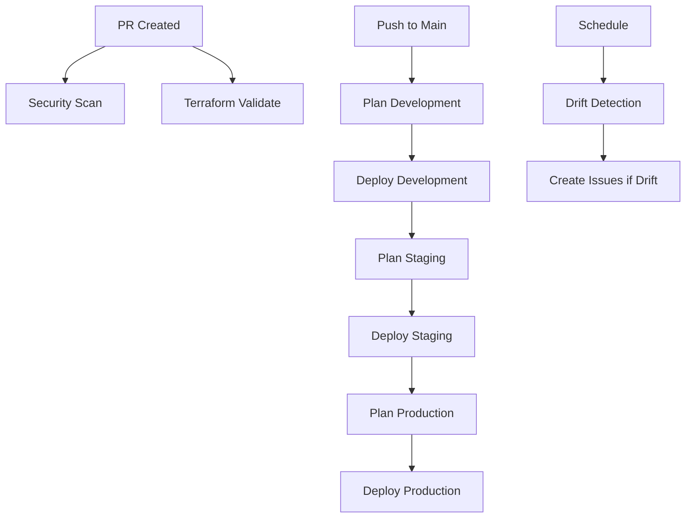

# GitOps Infrastructure Deployment

This repository implements a comprehensive GitOps workflow for Azure infrastructure deployment using Terraform and Azure Verified Modules (AVM).

## 🚀 Workflow Features

### ✅ Security & Validation
- **Security Scanning**: Checkov scans on every PR
- **Terraform Validation**: Format, init, and validate checks
- **Environment Protection**: GitHub environments with approval gates

### 📊 Multi-Environment Pipeline
- **Development**: Auto-deploy on main branch push
- **Staging**: Sequential deployment after dev success
- **Production**: Manual approval required

### 🔍 Drift Detection
- **Scheduled**: Runs weekdays at 6 AM UTC
- **Automatic Issues**: Creates GitHub issues when drift detected
- **Multi-Environment**: Checks all environments simultaneously

## 🏗️ Repository Structure

```
├── .github/workflows/
│   ├── gitops-deployment.yml    # Main GitOps pipeline
│   └── terraform-checks.yml     # Legacy validation (backup)
├── live_terraform_project/
│   ├── main.tf                  # AVM-based infrastructure
│   ├── backend-development.tf   # Dev environment backend
│   ├── backend-staging.tf       # Staging environment backend
│   └── backend-production.tf    # Production environment backend
├── configs/
│   ├── development.tfvars       # Dev environment variables
│   ├── staging.tfvars          # Staging environment variables
│   └── production.tfvars       # Production environment variables
└── README.md
```

## ⚙️ Setup Requirements

### GitHub Secrets
Configure these secrets in your repository:

```bash
AZURE_CLIENT_ID       # Service Principal Client ID
AZURE_CLIENT_SECRET   # Service Principal Secret
AZURE_SUBSCRIPTION_ID # Target Azure Subscription
AZURE_TENANT_ID      # Azure AD Tenant ID
```

### GitHub Environments
Create these environments with protection rules:

1. **development** - No approval required
2. **staging** - Optional: Require reviewers
3. **production** - Require reviewers + deployment protection

## 🔄 Workflow Triggers

### Automatic Triggers
- **PR Creation**: Security scan + validation
- **Main Branch Push**: Full deployment pipeline (dev → staging → prod)
- **Schedule**: Drift detection (weekdays 6 AM UTC)

### Manual Triggers
- **Workflow Dispatch**: Deploy specific environment
- **Actions**: plan, apply, or destroy

## 📋 Pipeline Flow



## 🛠️ Usage Examples

### Deploy to Specific Environment
```bash
# Go to Actions tab → GitOps Infrastructure Deployment → Run workflow
# Select environment: development/staging/production
# Select action: plan/apply/destroy
```

### View Deployment Status
```bash
# Check workflow runs in Actions tab
# Review environment deployment history
# Monitor for drift detection issues
```

## 🔧 Customization

### Adding New Environments
1. Create new backend file: `backend-{env}.tf`
2. Add environment config: `configs/{env}.tfvars`
3. Update workflow matrix in drift-detection job

### Modifying Approval Rules
1. Go to Settings → Environments
2. Configure protection rules per environment
3. Add required reviewers or deployment delays

## 🚨 Troubleshooting

### Common Issues

**Backend Configuration**
- Ensure backend-{env}.tf files exist
- Verify Azure storage account permissions

**Drift Detection**
- Check terraform plan output in workflow logs
- Review generated GitHub issues for details

**Environment Secrets**
- Verify all Azure secrets are configured
- Test service principal permissions

## 📚 Best Practices

### Infrastructure Changes
1. Create feature branch
2. Make changes in `live_terraform_project/`
3. Open PR (triggers validation)
4. Merge to main (triggers deployment)

### Emergency Deployment
1. Use workflow dispatch for urgent changes
2. Select specific environment and action
3. Monitor deployment progress

### Drift Resolution
1. Review drift detection issues
2. Investigate infrastructure changes
3. Update Terraform to match or revert changes
4. Re-run deployment to sync state

---

🔗 **Related Documentation**
- [Azure Verified Modules](https://azure.github.io/Azure-Verified-Modules/)
- [Terraform Azure Provider](https://registry.terraform.io/providers/hashicorp/azurerm/latest)
- [GitHub Actions Workflows](https://docs.github.com/en/actions/using-workflows)
